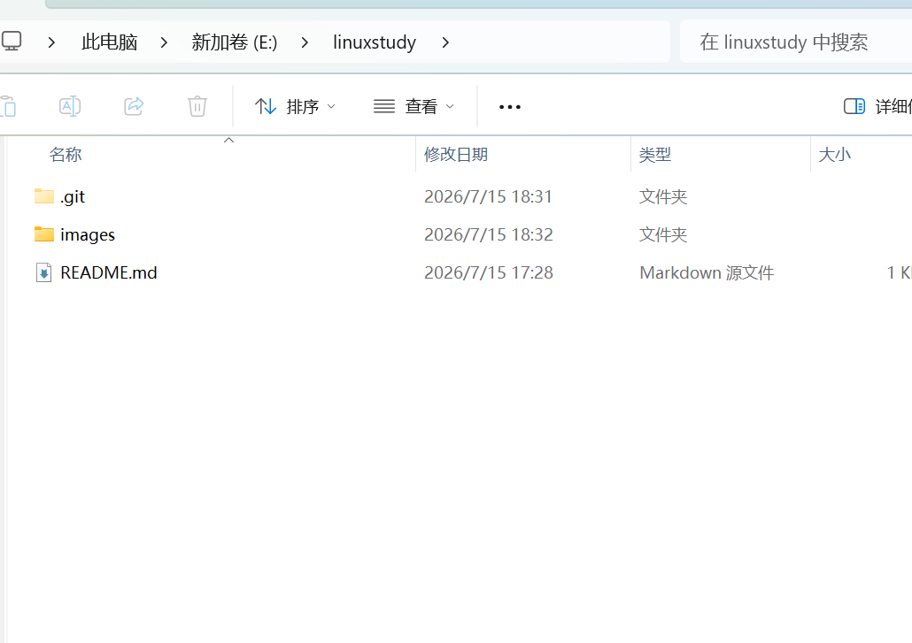

# 日常使用GitHub书写博客的方法

使用vscode打开初始化过的文件夹
创建一个.md文件就可以写你的博客了
创建一个images文件夹存放截图
![截图](./images/图片.png略）这就是插入图片的代码，图片名称请自行修改代码并删除略，如下图所示
 
保存本地文档                  
把所有修改加入暂存区，使用代码：git add .
填写本次修改说明，引号里写清楚改了什么使用代码：git commit -m "这里写本次修改内容"
推送到GitHub云端，使用代码：git push
