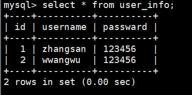
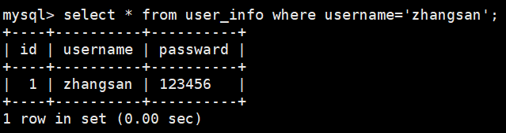
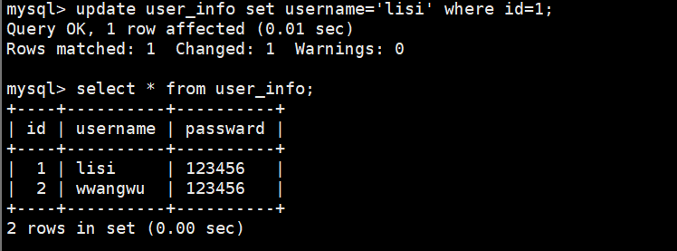

# MySQL 日常管理 ：账号密码修改、用户授权管理基本增删改查、备份

注意：在本文我将介绍mysql的一些日常使用方法，大由于mysql使用的语言是SQL，所以如 果我前面标注sql，那么表明是登陆mysql后使用SQL命令，不同于在linux命令行使用的bash命令，mysql命令后面一般都带一个分号；代表语句结束。

1. 首先启动mysald，使用命令：systemctl start mysqld，登陆mysql，使用命令：mysql -uroot -p。
2. 修改root密码。当我们想要修改root密码，那我们先登陆mysql，然后使用sql命令：alter user 'root'@'localhost' identified by '新密码';，再重载一下，使用sql命令：flush privileges;，就修改好了。
3. 用户创建与授权。真实的生产环境中，一般都会存在多个用户，每个用户都有不同的权限，比如数据库管理员、开发人员、测试人员等等。那么我们如何创建用户，给用户分配不同的权限呢？
   3.1 创建用户。使用sql命令：create user '用户名'@'localhost' identified by '密码'；，可以退出一下，使用命令：mysql -u用户名 -p，输入密码，就可以登陆了。
   3.2 授权用户。使用sql命令：grant 权限 on 数据库.表 to '用户名'@'localhost';，这里的权限有，all privileges(所有权限)、select（查表内容）、insert（增加表内容）、update（改表内容）、delete（删表内容），create（创建表结构）、drop（删除表结构）、alter（修改表结构）等等。表结构与表内容的区别就在，如果你删了表内容相当于在一个excel中删除了数据，文件本身还在，如果你删除了表结构，相当于在excel中删除了整个文件。比如：grant select on 库名.表名 to '用户名'@'localhost';，表示给用户名授予查找权限，一般的数据库用户最多只能给查找权限。如果是需要有写入等需求的用户，也只能给对于表内容相关修改的权限：select、insert、update、delete，切忌授权DROP、ALTER这类高危权限，避免程序异常误删表。
3. 基本增删改查。
   3.1 首先我们要明白数据库的基本结构，数据库由数据库名、表、字段、索引、数据组成，数据库包含着多个表，每个表又包含多个字段，字段又包含多个索引，索引又包含多个数据。那么我们想要建立一个基本的数据库结构，就首先要创建一个库，给这个库一个名字，使用sql命令：create database 库名；，然后进入或者说使用这个库中，使用sql命令：use 库名；。
   3.2 进入库了我们就要在库里面创建多个表，使用sql命令:create table 表名（字段名 类型（括号内声明长度） primary key（主键） auto_increment（自增），字段名 类型），常见的数据类型有整形、字符串、日期等等，比如：int、varchar、datetime等等。一个表中必须有一个或者多个主键，用primary key表示，主键是在表内具有唯一性的一个字段，比如你的身份证号满足了唯一性，在你的身份信息这个表中，身份证号就是主键。而整数类型的主键一般会设置自增，自增的id一般会从1开始，递增。接下来举个例子:create table user(id int primary key auto_increment,username varchar(20),password varchar(20));。
   3.3 插入，增加数据。使用sql命令：insert into 表名（字段名） values(值1);，这个值和前面的字段是对应关系，比如，insert into user(username,password) values('zhangsan','123456');，我们就插入了一个username为zhangsan，password为123456的数据。
   3.4 查询。使用sql命令：select 字段名 from 表名;，比如，select * from user;，*标识所有，就会显示表中所有数据。
                        
   如果你想对数据进行筛选，比如：select * from user where username='zhangsan'；，就会列出user表中username为zhangsan的所有数据。
                       
   3.5 修改表内容。使用sql命令：update 表名 set 字段名=值 where 条件;，比如：update user set username='lisi' where id=1;，就会将id为1的username修改为lisi。修改必须要有where条件，否则就会修改所有数据。
                       
   3.6 修改表结构。使用sql命令:alter table 表名 add 字段名 字段类型;,增加表字段；alter table 表名 modify 字段名 字段类型（长度）;,修改表字段；alter table 表名 change 旧字段名 新字段名 类型（长度）;，修改字段名，长度；alter table 表名 drop 字段名;,删除表字段。
   3.7 删除表内容。使用sql命令：delete from 表名 where 条件;，比如：delete from user where id=1;，就会将id为1的表内容删除。
   3.8 删除表结构。使用sql命令：drop table 表名;，比如：drop table user;，就会将user表删除。
   3.9 删除数据库。使用sql命令：drop database 库名;，比如：drop database test;，就会将test数据库删除。
4. 数据库备份与恢复。退出mysql，使用linux的bash命令：mysqldump -u用户名 -p 数据库名 > 文件名(date +%Y%m%d).sql;，数据库备份。mysql -u用户名 -p < 文件名.sql;，数据库恢复。